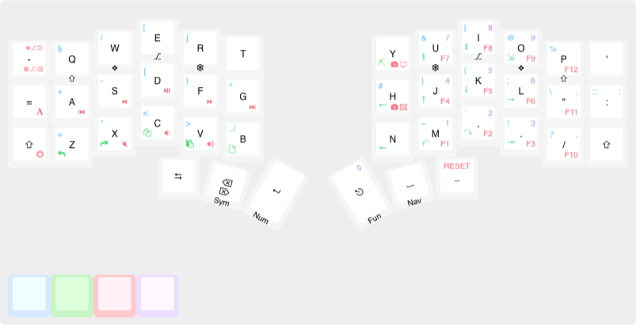
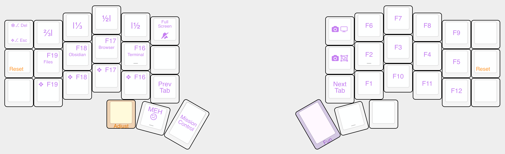
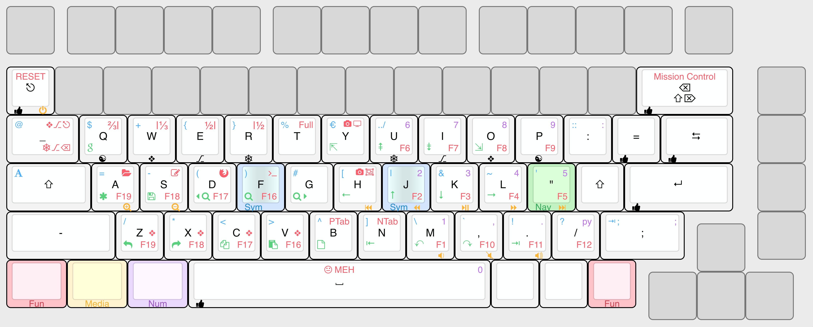
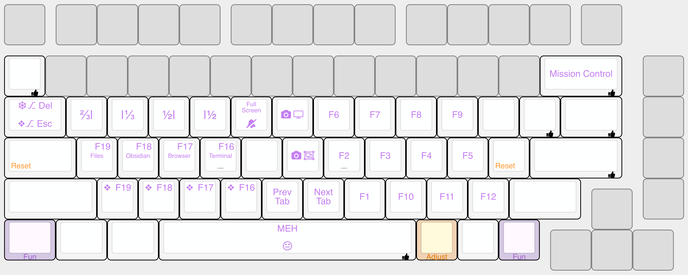

# Mark Bromell's Glorious GMMK Pro keymap

The purpose of this keymap is to adapt my muscle memory to a
[crkbd corne](https://github.com/foostan/crkbd) layout, but instead mapped on
top of my GMMK Pro. I am doing this because I will be building a corne, but
it will take a few weeks or months, so in the meantime I want to have a layout
that I know will work for the corne, and so that I can confidently go ahead and
build one without the risk of me regretting ever building it (in the event that
it is unusable for me).

Note: The screenshots of the layouts may not be up to date, use the
`<map>.json` file and import it into http://www.keyboard-layout-editor.com
to see a more up to date layout.

So I initially designed a layout that I believe will work well for me on the
corne, and then I mapped that layout onto the GMMK Pro, here are the layouts.

## Corne layout

## Glorious GMMK Pro layout

