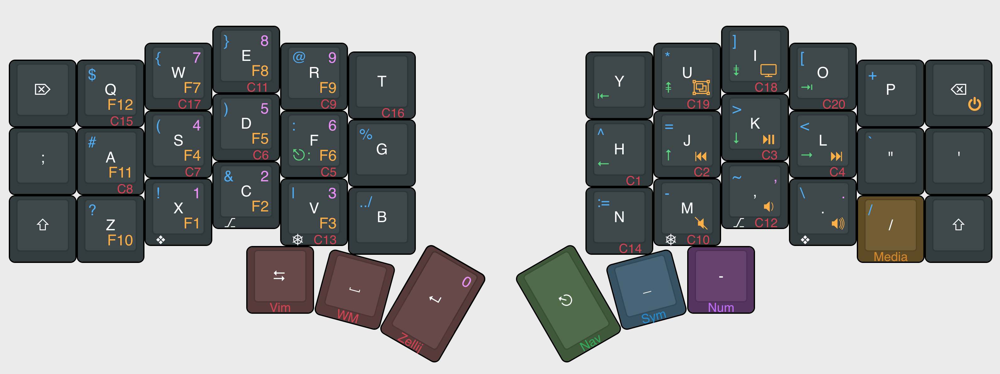
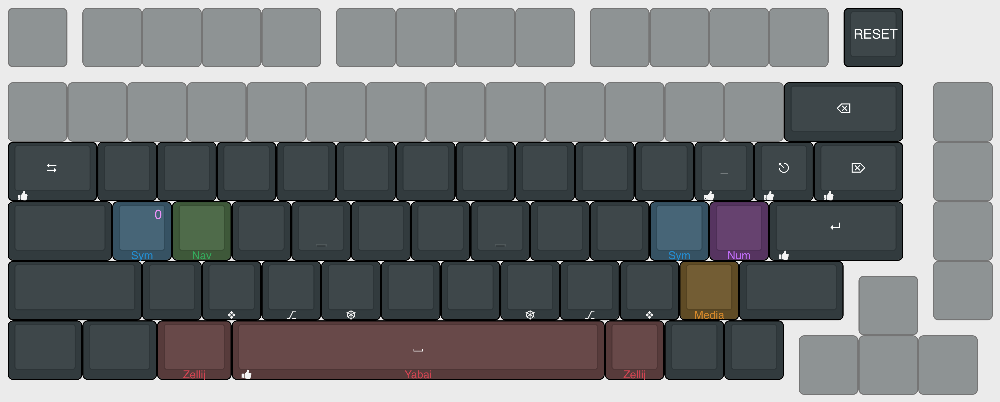

# mbromell Glorious GMMK Pro keymap

The purpose of this keymap is to adapt my muscle memory to a
[crkbd corne](https://github.com/foostan/crkbd) layout, but instead mapped on
top of my GMMK Pro. I am doing this because I will be building a corne, but it
will take a few weeks or months, so in the meantime I want to have a layout that
I know will work for the corne, and so that I can confidently go ahead and build
one without the risk of me regretting ever building it (in the event that it is
unusable for me).

So I designed a layout that I believe will work well for me on the corne, and
then I mapped that layout onto the GMMK Pro, here are the layouts.

## Layouts

### Corne layout

### Glorious GMMK Pro layout

The GMMK layout will only show the diff view of the corne. It is not possible to
have a perfect 1:1 map between the two keyboards, so some differences have to be
compensated for. Rather than diagramming every key the exact same, this would
waste time and also it would not highlight the differences well enough. So in
the actual QMK implementation, I reference the Corne layout, then I will
reference the GMMK layout and override anything from the Corne layout.

## Zen navigation

This is beyond the scope of the regular layout, and a very custom solution
to doing navigation and window management around my development environment.
The full implementation of this goes way beyond QMK and this repo, but here is
the table of codes along with their meaning and mappings.

I have doubts that this is even a good thing to do, it is really just an
experiment, so for now I will leave the details about it vague.

|                  | Code   | Window Manager | Zellij    | Vim |
| ---------------- | ------ | -------------- | --------- | --- |
| Focus            | `C1-4` | `C F13-16`     | `A ←↑→↓`  |     |
| Move             |        | `C+S F13-16`   | `A !@#$`  |     |
| Resize           |        | `C+G F13-16`   | `A %^&*`  |     |
| Tab Focus        | `C5-8` | `C+S+G F13-16` | `A ,./;`  |     |
| Win Rotate CW    | `C9`   | `C F17`        | `A [`     | -   |
| Win Rotate CCW   |        | `C+S F17`      | `A ]`     | -   |
| Win Fullscreen   | `C10`  | `C+G F17`      | `A _`     |     |
| Win Equalise     | `C11`  | `C+S+G F17`    | -         |     |
| Win Toggle Float | `C12`  | `C F18`        | `A \`     | -   |
| Win Toggle Split | `C13`  | `C+S F18`      | -         |     |
| Win New Right    | `C14`  | -              | `A '`     |     |
| Win New Down     |        | -              | `A "`     |     |
| Win Close        | `C15`  | `G q`          | `A ~`     |     |
| Tab New          | `C16`  | -              | `A \|`    |     |
| Tab Close        | `C17`  | -              | `` A ` `` |     |
| Tab Right        | `C18`  | -              | `A ?`     |     |
| Tab Left         | `C19`  | -              | `A :`     |     |
| Session manager  | `C20`  | `C ↑`          | `A (`     | -   |

Here is what some of the terms mean between each application

|                     | Window Manager  | Zellij          | Vim    |
| ------------------- | --------------- | --------------- | ------ |
| **Tab**             | Workspace       | Tab             | Tab    |
| **Win**             | Window          | Pane            | Window |
| **Session manager** | Mission control | Session manager | -      |
